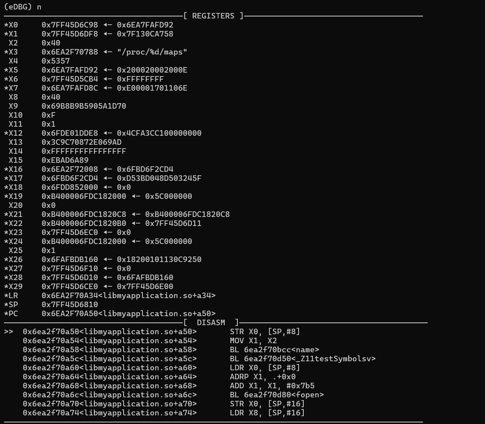

<p align="center"> </p>


> eDBG 是一款基于 eBPF 的轻量级 CLI 调试器。<br />
>
> 相比于传统的基于 ptrace 的调试器方案，eDBG 不直接侵入或附加程序，具有较强的抗干扰和反检测能力。

## ✨ 特性

- 基于 eBPF 实现，引入较少特征，难以被目标程序察觉或干扰
- 支持常规调试功能（详见“命令详情”）
- 使用类似 [pwndbg](https://github.com/pwndbg/pwndbg) 的 CLI 界面，类似 GDB 的交互方式，简单易上手
- 基于文件+偏移的断点注册机制，可以快速启动，支持多线程或多进程调试。

## 💕 演示



## 🚀 运行环境

- 目前仅支持 ARM64 架构的 Android 系统，需要 ROOT 权限，推荐搭配 [KernelSU](https://github.com/tiann/KernelSU) 使用
- 系统内核版本5.10+ （可执行`uname -r`查看）

## ⚙️ 使用

从 Releases 或者下载最新预编译好的二进制即可

1. 推送到手机的`/data/local/tmp`目录下，添加可执行权限

   ```shell
   adb push eDBG /data/local/tmp
   adb shell
   su
   chmod +x /data/local/tmp/eDBG
   ```

2. 运行调试器

   ```shell
   ./eDBG -p com.pakcage.name -l libname.so -b 0x123456
   ```

   | 选项名称          | 含义                                                    |
   | ----------------- | ------------------------------------------------------- |
   | -p                | 必选，目标 APP 包名                                     |
   | -l                | 必选，目标动态库名称                                    |
   | -b                | 可选，初始断点列表，用逗号隔开                          |
   | -hide-register    | 可选，不在断点触发时打印寄存器信息                      |
   | -hide-disassemble | 可选，不在断点触发时打印汇编信息                        |
   | -t                | 可选，指定线程过滤器，eBPF 将在指定的线程**名称**下工作 |

3. 运行被调试 APP

   如果被调试 APP 正在运行中，eDBG 也可以直接附加，但 eDBG 不会主动拉起被调试 APP。

## ⚠️ 注意

- 由于本项目使用基于文件+偏移的断点注册机制，在调试系统库（`libc.so`、`libart.so`）时可能会比较卡顿。
- 本项目不能随时暂停被调试程序，因此如果没有可用的断点，该项目可能无法调试目标程序。
- 该项目可以在目标程序运行之前被运行，因此不支持在启动时指定线程 id。
- 最多支持 20 个启用的断点。

## 💡命令说明

- 断点 `break / b`
  - 偏移：`b 0x1234`，将设置断点在 eDBG **启动时设置**(`-l`)的动态库的对应偏移处。
  - 内存地址：`b 0x6e9bfe214c`，将设置断点在对应地址处，需要当前程序正在运行。
  - 库名+偏移：`b libraryname.so+0x1234`，库名和偏移之间用`+`连接，将设置断点在对应库的对应偏移处。
  - 当前偏移：`b $+1`，将设置断点在当前位置+**指令条数**的位置。
- 单步调试
  - `step / s` 单步运行一次，遇到函数则进入函数。
  - `next / n` 单步运行一次，遇到函数不进入函数。
- 查看内存 `examine / x`
  - 地址：`x 0x12345678`，查看对应内存地址的内存，默认长度为 16。
  - 地址+长度：`x 0x12345678 128`，查看对应内存地址对应长度的内存。
  - 寄存器：`x X0`，查看对应寄存器地址对应的内存(`[X0]`)，默认长度为16。
  - 寄存器+长度：`x X0 128` ，查看对应寄存器地址对应长度的内存(`[X0]`)。
- 继续运行 `continue / c`：继续运行程序直到下一个断点。
- 展示内存 `display / disp`
  - 地址：`disp 0x123456`，展示对应地址的内存，将在每次触发断点或单步时打印，默认长度16。
  - 地址+长度：`disp 0x123456 128`，展示对应地址对应长度的内存，将在每次触发断点或单步时打印。
  - 地址+长度+变量名：`disp 0x123456 128 name`，展示对应地址对应长度的内存，将在每次触发断点或单步时打印，同时打印该变量名。
  - **注意：由于 eDBG 不直接和被调试程序运行状态相关，如果在调试过程中被调试程序发生重启（内存地址变化），此功能将无法输出正确信息。**
- 退出 `quit / q`：退出**调试器**。此操作不会影响程序运行。
- 取消展示内存：`undisplay / undisp <id>`：取消展示第 id 号变量。你可以在 display 中找到所有变量的编号，从 0 号开始。
- 查看代码：`list / l / disassemble / dis`
  - 直接查看：`l`，打印当前 PC 位置开始 10 条指令。
  - 查看指定地址：`l 0x1234`，打印对应内存地址 10 条指令。
  - 查看指定地址指定长度指令：`l 0x1234 20`，打印对应内存地址对应**指令条数**的指令。、
- 查看信息：`info / i`
  - `info b/break`：列出当前所有断点。`[+]`表示已启用的断点，`[-]`表示未启用的断点。
  - `info register/reg/r`：查看所有寄存器信息。
  - `info thread/t`：列出当前所有线程和已设定的线程过滤器。
- 退出函数：`finish / fi`：执行直到当前函数退出。
- 启用断点：`enable id`，启用第 id 号断点。你可以在 `info` 中查看断点信息。
- 禁用断点：`disable id`，禁用第 id 号断点。你可以在 `info` 中查看断点信息。
- 删除断点：`delete id`，删除第 id 号断点。你可以在 `info` 中查看断点信息。
- 运行直到：`until / u`：运行直到指定地址。地址的指定方法与断点相同。
- 线程相关：`thread / t`
  - `t`：列出所有可用线程。
  - `t + 0`：增加线程过滤器在第 0 个线程，可以用`info t`查看所有线程 id。（注意不是指定 `tid`）
  - `t - 0`：取消第 0 个线程过滤器，可以用`info t`查看所有线程过滤器 id。
  - `t all`：删除所有线程过滤器，在全部线程下运行。
  - `t +n threadname`：增加线程过滤器，过滤名为`threadname`的线程。
- 不输入任何命令直接回车：执行上一条命令。


## 🛫 编译

1. 环境准备

   本项目在 x86 Linux 下交叉编译

   ```
   sudo apt-get update
   sudo apt-get install golang==1.18
   sudo apt-get install clang==14
   export GOPROXY=https://goproxy.cn,direct
   export GO111MODULE=on
   ```

2. 编译

   ```
   git clone --recursive https://github.com/Sh11no/eDBG.git
   make
   ```

## 💭 实现原理

- 基本是简单的基于 uprobe 和 SIGSTOP / SIGCONT 的简易调试...填坑中

## 🧑‍💻 To Do

- 符号解析
- 隐藏 maps 中的 uprobe 特征
- 保存当前进度到文件 / 从文件中加载配置
- frame 功能
- backtrace 功能
- watch 功能

## 🤝 参考

- [SeeFlowerX/stackplz](https://github.com/SeeFlowerX/stackplz/tree/dev)
- [pwndbg](https://github.com/pwndbg/pwndbg)

## ❤️‍🩹 其他

- 喜欢的话可以点点右上角 Star 🌟
- 欢迎提出 Issue 或 PR！
