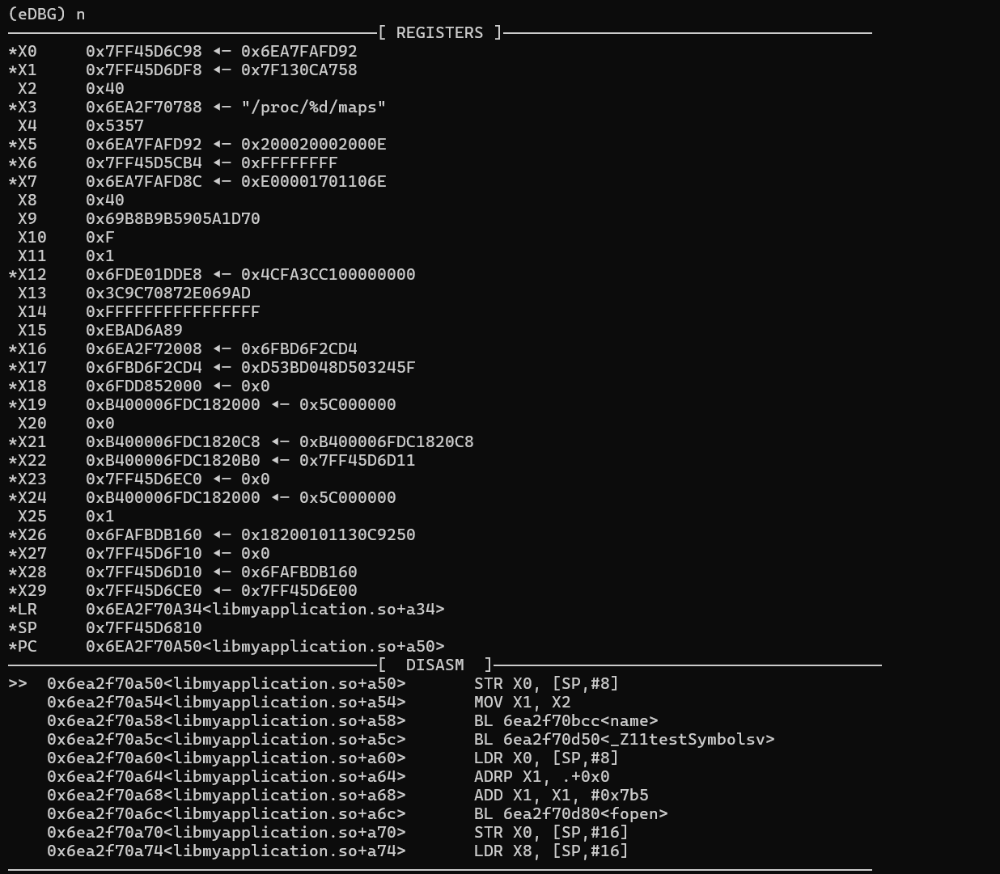

<div align="center">
  

  [](https://github.com/ShinoLeah/eDBG/releases)
  [](LICENSE)
  [](https://www.android.com/)
  

  [简体中文](READM.md) | English

</div>

> eDBG is a lightweight CLI debugger based on eBPF.<br />
>
> Compared to traditional ptrace-based debuggers, eDBG doesn't directly intrude or attach to processes, offering stronger resistance to interference and anti-detection capabilities.

## ✨ Features

- eBPF implementation introduces minimal footprint, making it almost impossible to be detected by target programs
- Supports common debugging functionalities (see "Command Details")
- Uses pwndbg-like CLI interface with GDB-style interactions for ease of use
- File+offset based breakpoint registration enables quick startup and supports multi-thread/process debugging

## 💕 Demo



## 🚀 Requirements

- Currently only supports ARM64 Android devices with ROOT access (Recommended with [KernelSU](https://github.com/tiann/KernelSU))
- Kernel version 5.10+ (Check via `uname -r`)

## ⚙️ Usage

1. Download prebuilt binaries from [Releases](https://github.com/ShinoLeah/eDBG/releases)

2. Push to device and grant permissions:
   ```shell
   adb push eDBG /data/local/tmp
   adb shell
   su
   chmod +x /data/local/tmp/eDBG


3. Start debugger:

   ```shell
   ./eDBG -p com.package.name -l libname.so -b 0x123456
   ```

   |      Option       |                         Description                          |
   | :---------------: | :----------------------------------------------------------: |
   |        -p         |                   Target app package name                    |
   |        -l         |                  Target shared library name                  |
   |        -b         |            Initial breakpoints (comma-separated)             |
   |        -t         |        Thread name filter for eBPF (comma-separated)         |
   |        -i         |               Load config from specified file                |
   |        -s         |                  Save config to input file                   |
   |        -o         |                Save config to specified file                 |
   |  -hide-register   |             Disable register info on breakpoints             |
   | -hide-disassemble |             Disable assembly info on breakpoints             |
   |    -disable-hw    | Disable Hardware breakpoints(Refer to the 'Implementation' section) |

4. Launch target app:

   > eDBG can attach to running processes but won't auto-launch apps.

## ⚠️ Notes

- Debugging system libraries (e.g., `libc.so`, `libart.so`) may cause lag due to file+offset mechanism
- Program pause isn't supported without active breakpoints
- Thread ID specification during startup isn't supported
- Maximum 20 active breakpoints

## 💡 Commands

- **Breakpoints** `break/b`

  - Offset: `b 0x1234` (relative to debugger's initial library)
  - Memory: `b 0x6e9bfe214c` (requires running process)
  - Library+Offset: `b library.so+0x1234`
  - Relative: `b $+1` (current position +1 instruction)

- **Continue** `continue/c`: Resume execution

- **Stepping**

  - `step/s`: Step into functions
  - `next/n`: Step over functions

- **Function Finish** `finish/fi`: Execute until function return

- **Run Until** `until/u <address>`: Execute to specified address

- **Memory Examination** `examine/x`

  - Address: `x 0x12345678` (default 16 bytes)
  - Address+Length: `x 0x12345678 128`
  - Register: `x X0` (access [X0] memory)
  - Register+Length: `x X0 128`

- **Memory Display** `display/disp`

  - Address: `disp 0x123456` (auto-print on breaks/steps)
  - Address+Length: `disp 0x123456 128`
  - Named: `disp 0x123456 128 name`

  > ⚠️ Memory address changes (e.g., app restart) may invalidate displays

- **Undisplay** `undisplay/undisp <id>`: Remove auto-display

- **Write Memory** `write address hexstring` Target address must be writable

- **Memory Dump** `dump address length filename`

- **Exit** `quit/q`: Exit debugger (won't affect target process)

- **Code Listing** `list/l/disassemble/dis`

  - Current: `l` (10 instructions from PC)
  - Specific: `l 0x1234` (10 instructions)
  - Custom: `l 0x1234 20` (20 instructions)

- **Information** `info/i`

  - `info b/break`: List breakpoints (`[+]`=enabled, `[-]`=disabled)
  - `info register/reg/r`: Show registers
  - `info thread/t`: List threads & filters

- **Breakpoint Management**

  - `enable <id>`: Enable breakpoint
  - `disable <id>`: Disable breakpoint
  - `delete <id>`: Remove breakpoint

- **Thread Control** `thread/t`

  - `t`: List threads
  - `t + 0`: Add thread filter (use `info t` for IDs)
  - `t - 0`: Remove filter
  - `t all`: Clear all filters
  - `t +n threadname`: Filter by thread name

- **Set Symbol** `set address name`：Name specified address

- **Repeat Command**: Press Enter with empty input

## 🛫 Compilation

1. **Environment Setup** (x86 Linux cross-compilation)

   ```shell
   sudo apt-get update
   sudo apt-get install golang-1.18
   sudo apt-get install clang-14
   export GOPROXY=https://goproxy.cn,direct
   export GO111MODULE=on

2. **Build**

   ```shell
   git clone --recursive https://github.com/ShinoLeah/eDBG.git
   ./build_env.sh
   make
   ```

## 💭 Implementation

- All breakpoints are implemented using uprobes. It is recommended to place breakpoints on jump instructions (B-series instructions/RET/CBZ/TBNZ) to avoid introducing identifiable signatures in `/proc/maps`.
2. The `step/next/finish/until` features utilize hardware breakpoints by default, which cannot be detected by user-mode processes. You can safely use these features without concerns. If these features are not functioning properly, consider enabling the `-disable-hw` option.

## 🧑‍💻 Todo

- Frame support
- Backtrace functionality
- Watchpoints

## 🤝 References

- [SeeFlowerX/stackplz](https://github.com/SeeFlowerX/stackplz/tree/dev)
- [pwndbg](https://github.com/pwndbg/pwndbg)

## ❤️ Support

- Star this repo 🌟 if you find it useful
- Issues and PRs are welcome!